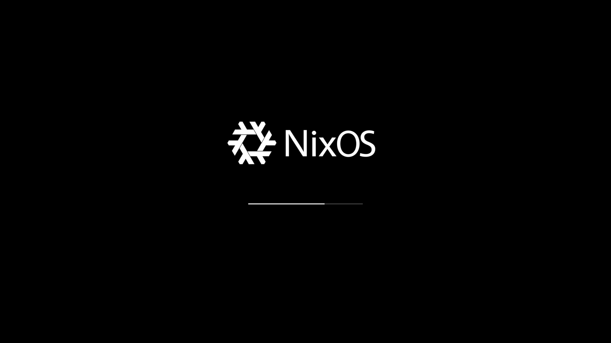
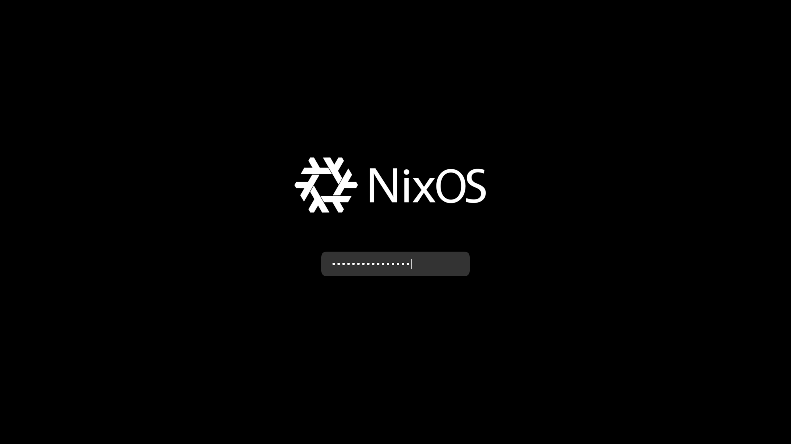

# Plymouth Theme Neat (NixOS)

HiDPI-Friendly Plymouth Theme for NixOS

Based on the original [Plymouth Theme Neat](https://github.com/neetly/plymouth-theme-neat) for Arch Linux.

| Default                                          | Password                                           |
| ------------------------------------------------ | -------------------------------------------------- |
|  |  |
